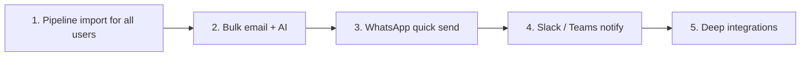

# Connect Intel — Phase 2 roadmap (integrations, WhatsApp, import, bulk email)

Use this to decide **order of build** before implementation. Each item lists what exists today, the production approach, and effort.

---

## What you already have (don’t rebuild)

| Need | Status today |
|------|----------------|
| Company pipeline CSV/XLSX upload | **Team** page → import section (`OrgPipelineImport`) — **company admin only** |
| Single-lead CRM email + AI draft + agenda | **Pipeline** → lead → **Email** tab |
| Unlimited company sending (no Google test users) | **Team → Outbound email (CRM)** — Resend domain + DNS (automatic) |
| Integrations UI shell | **Integrations** sidebar — placeholders (“soon”) |

---

## Recommended build order



**Why this order:** import and bulk email reuse current CRM + Resend; WhatsApp and Slack need new vendors and compliance; deep CRM sync is largest.

---

## 1. Pipeline import (Admin + Team + individuals)

### Goal
Every customer uploads their **existing Excel/CSV pipeline** and works in Connect Intel the same day.

### Gaps today
- Import is **org admin only** (`org/imports` API).
- No “my leads only” import for **team members** or **individual** accounts.
- Import lives under **Team** — easy to miss.

### Proposed product
| Role | Can import | Leads go to |
|------|------------|-------------|
| Company admin | Yes | Org pipeline (all or assign later) |
| Team member | Yes (toggle) | Own pipeline or shared pool (admin setting) |
| Individual account | Yes | Personal saved leads / pipeline |

### Backend (automatic from panel)
- `POST /api/org/imports` — allow `org_admin` + members with `canImportPipeline` permission.
- `POST /api/my/imports` — individual accounts (same parser, `userId` scope).
- Column mapper UI: match their headers → `firstName`, `company`, `email`, `phone`, `status`, `notes`.
- Dedupe by email / company+phone; show import report (added / skipped / errors).

### UI
- **Pipeline** page: prominent **Import pipeline** button (not only Team).
- Reuse `parseUploadFile` + template download.

**Effort:** ~1–2 weeks  
**Dependencies:** None (built on existing import code)

---

## 2. Bulk email + AI (multiple leads)

### Goal
Select many leads → one agenda → AI generates **per-lead** (or one template with merge fields) → send in batch from company domain.

### Gaps today
- Only **one lead at a time** in `crm-send-email`.
- No multi-select on pipeline board / table.

### Proposed product
1. **Pipeline** / **Saved leads**: checkboxes + “Email selected (N)”.
2. Modal: agenda, key points, purpose, tone (same as single email).
3. **Preview** first 3 drafts → **Send all** (rate-limited queue).
4. Log each send on lead `crm.emails` + activity; show progress bar.

### Backend
- `POST /api/crm/bulk-email` — `{ leadIds[], agenda, keyPoints, purpose }`.
- Server loop: `generateAiEmail` per lead → `sendCrmEmailViaOrgResend` (existing).
- Cap e.g. **50 per batch**; optional delay to respect Resend rate limits.
- Idempotency key per batch to prevent double-send on retry.

### Rules
- Same as single send: org domain verified, user `@company.com`.
- Skip leads without email; report failures in summary.

**Effort:** ~1–2 weeks  
**Dependencies:** Outbound email domain verified (Phase 1 email — done)

---

## 3. WhatsApp

### Goal
Reps send **AI drafts** to customers on WhatsApp from Connect Intel, using **their mobile number** (admin + team captured at onboarding/invite).

### Important: two tiers

#### Phase 3A — Quick win (no Meta approval) — **build first**
- Collect **E.164 mobile** on:
  - Company onboarding (admin mobile)
  - Team invite accept / profile (team mobile)
  - Optional: default “WhatsApp from this number” per user
- Lead workspace **WhatsApp** tab:
  - AI draft (reuse agenda + `generateAiEmail` adapted for short WhatsApp tone)
  - Button opens `https://wa.me/<leadPhone>?text=<encoded draft>`
  - Log activity: “WhatsApp draft opened / sent manually”
- **No** message delivery from server; user sends from their WhatsApp app.
- Works for **unlimited users** immediately.

#### Phase 3B — True send from panel (production scale) — **later**
- **WhatsApp Business Platform** (Meta Cloud API) via official BSP (Twilio, MessageBird, or direct Meta).
- Per-company **WABA** onboarding (business verification) — cannot be fully invisible; Meta requires business docs.
- Connect Intel stores:
  - `org.whatsappPhoneNumberId`
  - Encrypted access token
- Webhook for delivery/read receipts → CRM activity log.
- Template messages for first contact (Meta rule); free-form only inside 24h session window.

**Do not promise** “automatic WhatsApp for everyone” without Meta — same class of problem as Google `gmail.send`.

### Data model
```text
users.mobileE164          — rep WhatsApp / contact number
organizations.adminMobile — optional billing / primary contact
leads.phone               — already on lead; validate E.164 for wa.me
```

**Effort:** 3A ~3–5 days · 3B ~4–8 weeks + Meta review  
**Dependencies:** 3A none · 3B business verification per customer or platform WABA

---

## 4. App integrations (Slack, Microsoft Teams, …)

### Goal
Connect from **Integrations** panel; events flow both ways where possible.

### Realistic phases

#### Phase 4A — Notifications (easiest, high value)
| App | Connect | What it does |
|-----|---------|----------------|
| **Slack** | Incoming webhook URL **or** OAuth bot | Post to channel: new lead assigned, meeting in 30m, email sent, import done |
| **MS Teams** | Incoming webhook on channel | Same notifications |

- User pastes webhook URL in Integrations (no app store review).
- Or OAuth “Add to Slack” for richer bot (one Connect Intel Slack app, verified once).

#### Phase 4B — Interactive (medium)
- Slash command `/connectintel search` → returns link.
- Button “Open in Connect Intel” on notifications.

#### Phase 4C — Full CRM sync (largest)
- HubSpot / Salesforce / Zoho — OAuth + field mapping + sync jobs.
- **Months** per integration; enterprise pricing tier.

### Backend shape (all automatic from panel)
```text
organizations.integrations.slack = { webhookUrl, channel, enabled }
organizations.integrations.teams = { webhookUrl, enabled }
POST /api/integrations/slack/test
POST /api/integrations/slack/notify  (internal, from CRM events)
```

Store secrets encrypted in Supabase store; never expose webhook to frontend after save.

**Effort:** 4A ~1 week · 4B ~2 weeks · 4C per CRM ~6+ weeks  
**Dependencies:** Stable CRM events (you have `activities[]` today)

---

## 5. What should stay “platform once” vs “per customer”

| Item | Who sets up once | Customer self-serve in panel |
|------|------------------|------------------------------|
| Resend API key | Connect Intel (Vercel) | Domain DNS only |
| Google sign-in OAuth | Connect Intel | — |
| Google Gmail API (optional) | Connect Intel verification | — |
| WhatsApp Cloud API | Connect Intel or per-org WABA | Business verification |
| Slack app | Connect Intel OAuth app | Pick channel / paste webhook |
| Pipeline import | — | Upload file |
| Bulk email | — | Select leads + send |

---

## Suggested milestones for promotion (“masses”)

| Milestone | User-visible |
|-----------|----------------|
| **M1** | Import pipeline from Excel (all roles) + bulk email |
| **M2** | WhatsApp tab (wa.me + AI) + mobile on profile |
| **M3** | Slack/Teams notifications |
| **M4** | WhatsApp API send (optional tier) |
| **M5** | HubSpot / Salesforce (enterprise) |

---

## Pick one to implement next

Reply with priority, e.g. **“M1 first”** or **“bulk email then WhatsApp 3A”**, and we implement in that order without manual Google/ops steps for customers.
