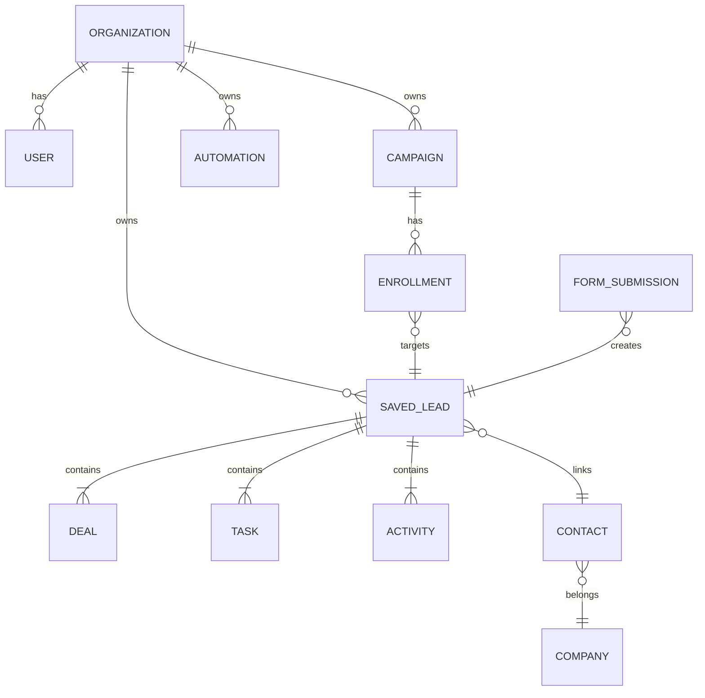

# Connect Intel — CRM Platform Evolution Blueprint

**Status:** Master reference for all modules (Sales, Marketing, Service, AI, Analytics, Automations).  
**Scope:** Evolve the existing product — do **not** greenfield rewrite to Next.js/NestJS/K8s unless explicitly approved.

**Live stack:** Vite + React · Vercel serverless · SQLite/JSON store (+ optional Supabase) · Resend/Gmail email.

**Design inspiration (original UI only):** HubSpot · Attio · Linear · Notion · Stripe — usability and polish, not copied assets.

---

## 1. Product vision

Connect Intel becomes a unified revenue platform:

| Pillar | Today | Target |
|--------|-------|--------|
| CRM | Pipeline-centric leads, deals nested per lead | Full object model + account hierarchy |
| Marketing | Mature hub (campaigns, segments, automations, landing) | Shared journeys + attribution |
| Sales | Kanban, sequences, workflow rules | Forecasting, multi-pipeline, visual workflows |
| Service | Support tickets (assistant) | Tickets tied to contacts |
| Automation | CRM rules + marketing graph runner | One engine, all modules |
| AI | Prospecting, assistant, email gen | Embedded in every record view |
| Analytics | Dashboards, rollups in store | Configurable reports + export |

**North star:** Every module shares **objects**, **timeline**, **permissions**, **automations**, and **reporting**.

---

## 2. Architecture principles

1. **Extend, don't replace** — build on `savedLeads`, handlers in `lib/server/handlers/`, panels in `frontend/src/components/`.
2. **Lead-first, evolve to objects** — pipeline row is the hub; promote Companies/Contacts/Deals to first-class views without breaking imports.
3. **Serverless-first scale path** — hot paths → Postgres partitions → Redis cache → Elasticsearch/ClickHouse when volume demands (marketing rollups already stub this pattern).
4. **No page reloads** — panel shell (`AppShell` + `appHistory`) remains the SPA router.
5. **Workspace isolation** — `organizationId` on every collection; tenant checks in handlers.

---

## 3. Information architecture

```
Workspace (org or individual)
├── Home
│   ├── Dashboard (overview)
│   ├── Team intelligence
│   └── Activity log
├── CRM
│   ├── Pipeline (leads kanban / table / deals view)
│   ├── Companies (planned — aggregate by account)
│   ├── Contacts
│   ├── Marketing hub
│   ├── Calendar
│   └── Automation (sequences + rules)
├── Collaboration — Chithi
├── AI prospecting — Search + saved database
└── Workspace / Settings
```

**Global affordances (platform shell):**

- Left sidebar (`Sidebar.jsx` + `navConfig.js`)
- Top command bar (`AppHeader.jsx`) + **⌘K command palette**
- Record workspace (`LeadWorkspace.jsx`) — tabs + right context
- Activity timeline (`crmTimeline.js`) on every record

---

## 4. Core objects

| Object | Storage today | Relationships | Phase |
|--------|---------------|---------------|-------|
| **Lead / Contact record** | `savedLeads[].lead` + `crm` | Deals, tasks, activities, emails | Exists |
| **Contact (master)** | `contacts` + `companies` | Import/search; link via `contactId` | Exists |
| **Company** | `companies` + `lead.company` string | Child leads by domain/name | **Phase 2** |
| **Deal** | `crm.deals[]` per lead | Lead, stage, amount | Partial |
| **Activity** | `crm.activities` + `marketingEvents` | Lead, campaign | Exists |
| **Task** | `crm.tasks` + `teamTasks` | Lead, assignee | Exists |
| **Meeting** | `crm.meetings` | Lead, calendar sync | Exists |
| **Campaign** | `marketingCampaigns` | Lists, segments, enrollments | Exists |
| **Workflow** | `crmWorkflowRules`, `marketingAutomations` | Triggers → actions | Partial |
| **Form / Landing** | `marketingForms`, `marketingLandingPages` | Submissions → lead | Exists |
| **Ticket** | `supportTickets` | User/org | Partial |
| **Custom object** | — | — | Future |

**Every object must support:** custom fields (org `crmSettings`), permissions, activity tracking, reporting hooks.

---

## 5. Object relationships (ER sketch)



---

## 6. Unified timeline

**Per-record timeline** (`frontend/src/lib/crmTimeline.js`) merges:

- CRM activities, notes, status changes
- Email sent/received (CRM + marketing)
- Marketing opens/clicks
- Tasks, meetings, deals
- Form submissions (via lead source)
- Workflow/sequence steps

**Target:** HubSpot-style chronological feed with filters (All · Emails · Meetings · Marketing · System).

**Global activity log** (`CrmActivityLogPanel`) remains the org-wide view.

---

## 7. Global search (⌘K)

**Phase 0 (shipped in this initiative):**

- `GET /api/platform/search?q=` — leads, contacts, campaigns, deals
- Command palette — navigation + record jump

**Phase 1:**

- Tasks, notes, team members, marketing templates
- Recent items + pinned views
- AI-assisted query interpretation

**Performance target:** &lt;300ms for orgs with 10k pipeline rows (client cache + server index).

---

## 8. Permissions model

| Layer | Implementation |
|-------|----------------|
| Workspace | `organizationId`, `tenantIsolation.js` |
| Org roles | `org_admin`, member, pipeline `sales` vs `member` |
| Marketing | `marketingRoles.js` — manager / executive / readonly |
| Record | Assignee + org visibility (`pipelineRoles.js`) |
| Field-level ACL | **Not built** — future |

---

## 9. Automation engine (unified target)

**Triggers (expand coverage):**

| Trigger | CRM rules | Marketing automations |
|---------|-----------|----------------------|
| Contact/lead created | Partial | `contact_added` |
| Status changed | Yes | — |
| Email opened/clicked | — | Yes |
| Form submitted | — | Yes |
| Deal won/lost | Partial (freight) | — |
| Task completed | — | Planned |
| No activity N days | Yes | — |

**Actions:** send email · create task · update record · assign owner · enroll sequence · webhook · update score · create deal.

**UX:** Reuse `AutomationCanvas.jsx` for CRM workflows (same graph runner pattern as marketing).

---

## 10. Lead scoring

**Today:** `crmLeadScore.js` — rule-based 0–100 on save.

**Target:**

| Event | Points (configurable per org) |
|-------|-------------------------------|
| Email open | +10 |
| Link click | +25 |
| Pricing page visit | +50 |
| Meeting booked | +100 |
| Unsubscribe | −25 |

Store rules in `org.crmSettings.scoringRules[]`; recompute on `marketingEvents` + website tracking webhooks. **Shipped:** CRM → Automation → Lead scoring; live refresh on email open/click/unsubscribe; bulk recompute API.

---

## 11. Reporting

**Today:** Overview, team dashboard, marketing dashboard, campaign reports, revenue attribution.

**Target tiers:**

1. **Pinned tiles** — admin-configurable home dashboard (`dashboardUi.jsx`)
2. **Module reports** — sales funnel, marketing attribution, team performance
3. **Custom report builder** — saved queries on rollups (ClickHouse-style aggregates in `marketingAnalyticsRollups` pattern)

---

## 12. AI layer

Embed in record context (not separate silo):

- Contact/lead summary (assistant context exists)
- Deal summary
- Email/subject writer (`crm-generate-email`)
- Workflow suggestions
- Follow-up recommendations
- Natural language search (command palette extension)

---

## 13. Design system

**Tokens:** `frontend/src/styles/platform-design-system.css`  
**Legacy patterns:** `index.css`, `hubspot-premium.css` — migrate gradually.

**Required primitives:**

| Component | Status |
|-----------|--------|
| Button / Input | CSS classes (`ci-btn`, `ci-input`) |
| Table / Data grid | `crm-table`, `PipelineLeadsTable` |
| Drawer | `LeadWorkspace`, filter sheets |
| Modal | `FullScreenDetailModal` |
| Command palette | **Phase 0** |
| Timeline | `crmTimeline` |
| Filter/Segment builder | Marketing segments |
| Workflow node | `AutomationCanvas` |
| Chart cards | `dashboardUi.jsx` |

**Layout contract:**

```
┌──────────┬─────────────────────────────────────┐
│ Sidebar  │ AppHeader (command bar)             │
│          ├─────────────────────────────────────┤
│          │ Panel content                       │
│          │  ┌─────────────────┬──────────────┐ │
│          │  │ Main            │ Context/     │ │
│          │  │                 │ drawer       │ │
│          │  └─────────────────┴──────────────┘ │
└──────────┴─────────────────────────────────────┘
```

---

## 14. Table experience (Attio/HubSpot bar)

Every list view should support:

- [x] Search (pipeline)
- [x] Saved views (`crmSavedViews`)
- [x] Bulk actions
- [ ] Column picker + persist
- [ ] Grouping
- [x] Org-shared views
- [x] Export (marketing reports; pipeline partial)

---

## 15. Performance & scale path

| Scale target | Approach |
|--------------|----------|
| 1M contacts | Master DB + pipeline shard; paginate all lists |
| 10M activities | Append-only events collection; timeline pagination |
| Sub-second search | `platform/search` → ES index when &gt;50k rows/org |
| 10M emails/mo | Queue sends (existing cron bursts); provider adapters |
| 1000 concurrent users | Vercel scale + store connection pooling |

**Do not** prematurely add Kubernetes — use managed services when JSON store limits hit.

---

## 16. Technology map (requested vs actual)

| Requested | Connect Intel approach |
|-----------|------------------------|
| Next.js | **Vite + React** (keep) |
| NestJS | **Vercel serverless handlers** (keep) |
| PostgreSQL | **SQLite/JSON + Supabase option** → migrate hot tables later |
| Redis | In-memory + cron; Redis when job queue needed |
| Elasticsearch | `platform/search` → ES when volume requires |
| ClickHouse | `marketingAnalyticsRollups` daily aggregates (exists) |
| BullMQ | Cron handlers (`marketing-cron`, `crm-reminders-cron`) |
| SES | Optional via `emailProviders/ses.js` |

---

## 17. Delivery roadmap

### Phase 0 — Platform shell (current sprint)

- [x] Master blueprint (this doc)
- [x] ⌘K command palette + unified search API
- [x] Design system tokens
- [ ] Cursor rule for agents

### Phase 1 — CRM depth (shipped)

- [x] Companies hub (account view aggregated from pipeline)
- [x] Org-custom pipeline stages (multiple pipelines per workspace)
- [x] CRM visual workflow builder (AutomationCanvas mode)
- [x] Timeline filters + marketing events on lead timeline
- [x] Configurable lead scoring (org-defined point rules)
- [x] Org-shared saved views
- [x] Hook deal-won automation triggers

### Phase 2 — Workflow unification (4–6 weeks)

- CRM visual workflow builder (reuse canvas)
- Configurable lead scoring rules
- [x] Website tracking pixel + UTM attribution

### Phase 3 — Analytics & AI (6–8 weeks)

- Configurable home dashboard tiles
- Custom report definitions
- AI summaries on lead/deal drawers
- NL search in command palette

### Phase 4 — Enterprise (ongoing)

- Field-level permissions
- Custom objects
- Full ES/ClickHouse migration for analytics
- Quotes/products module

---

## 18. Module ownership (file map)

| Module | Frontend | Backend |
|--------|----------|---------|
| Shell / nav | `layout/AppShell.jsx`, `navConfig.js` | — |
| Command palette | `platform/CommandPalette.jsx` | `handlers/platform-search.js` |
| Pipeline | `crm/PipelinePanel.jsx` | `handlers/saved-leads.js` |
| Lead record | `crm/LeadWorkspace.jsx` | `crmWorkflow.js` |
| Marketing | `marketing/MarketingPanel.jsx` | `handlers/marketing-*.js` |
| Automations | `AutomationCanvas.jsx` | `automationGraphRunner.js` |
| Permissions | — | `organizations.js`, `marketingRoles.js`, `pipelineRoles.js` |
| Scoring | pipeline filters | `crmLeadScore.js` |
| Reports | `OverviewPanel`, dashboards | `crmDashboard.js`, `marketingDashboard.js` |

---

## 19. Definition of done (any new feature)

1. Fits object model — updates timeline or reporting hooks
2. Respects workspace isolation and role checks
3. Works in panel shell without full page reload
4. Mobile-safe or explicitly desktop-only with fallback
5. `npm run prod:ship` passes
6. Documented in this blueprint or module README

---

*Last updated: Phase 0 platform shell — command palette + search.*
