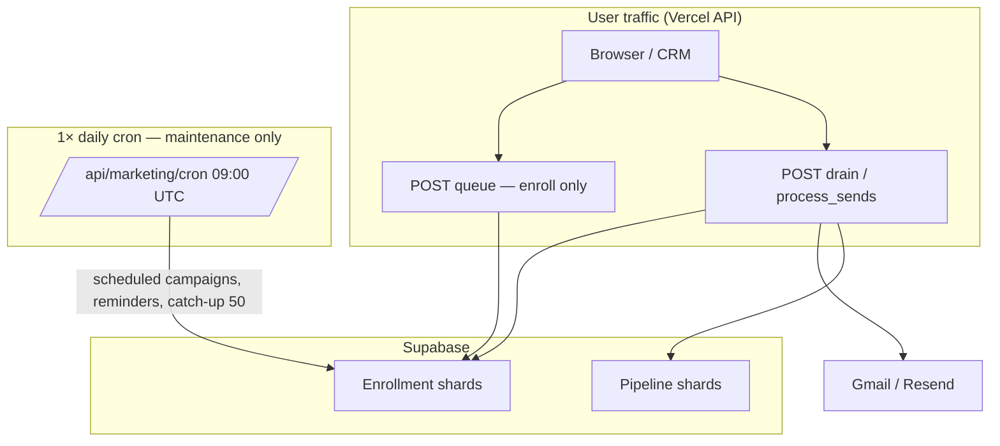
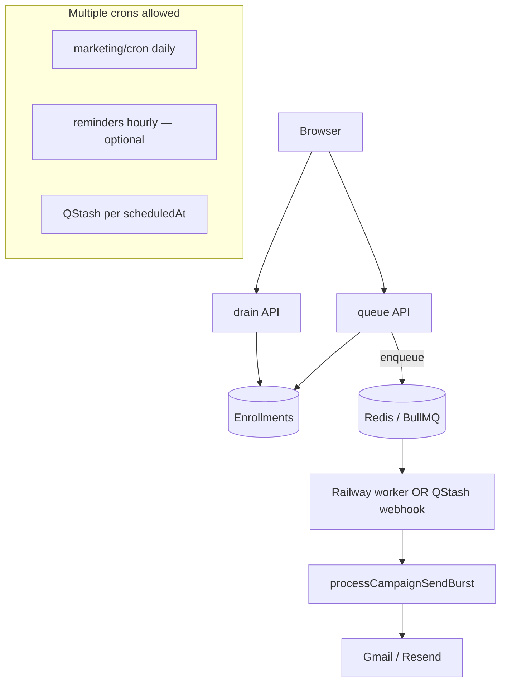

# Connect Intel — Cron audit & deployment architecture

**Generated:** June 2026  
**Context:** Vercel Hobby allows **at most one cron job per day**. A `*/5 * * * *` entry blocked production deploy.

---

## 1. Every scheduled cron (vercel.json)

| # | Path | Schedule | In vercel.json now? | Status |
|---|------|----------|---------------------|--------|
| 1 | `/api/marketing/cron` | `0 9 * * *` (daily 09:00 UTC) | **Yes** | LIVE |
| 2 | `/api/workers/cron` | `*/5 * * * *` (every 5 min) | **No** (removed — Hobby block) | API route only |

**No other Vercel crons exist.** GitHub Actions CI is push-triggered, not scheduled.

### API routes that look like crons but are NOT in vercel.json

| Path | Trigger | Purpose |
|------|---------|---------|
| `/api/workers/cron` | Manual `POST` + `CRON_SECRET` | Drain BullMQ (1 job/queue) |
| `/api/crm/reminders-cron` | Manual `POST` + `CRON_SECRET` | CRM calendar reminder emails only |

---

## 2. Cron audit report (detailed)

### Cron A — `/api/marketing/cron` (ONLY Vercel schedule)

| Field | Value |
|-------|-------|
| **Purpose** | Daily maintenance batch: RSS→campaigns, recurring campaigns, **scheduled** campaign starts, **catch-up** email sends, automations, CRM sequences, morning reminders, optional BullMQ drain |
| **Frequency** | Once/day — `0 9 * * *` UTC |
| **Runtime** | ~30s–3min (depends on enrollments + `updateStore` sequences) |
| **DB impact** | **High** when backlog exists: up to 50 `processDueEnrollments` sends, full-store `updateStore` for sequences, reminder dispatches, automation runs (20), RSS/recurring reads |
| **Critical?** | **Partially** — CRM reminders & scheduled campaigns need *some* scheduler; **manual email sends do not** |
| **Event-driven?** | Most sub-tasks have better triggers (see below) |
| **Merge?** | Already merges 8 subsystems into one daily job (Hobby-friendly) |
| **Should exist?** | **Yes** on Hobby (single daily slot). Split on Pro if needed. |

#### Sub-jobs inside marketing/cron

| Sub-job | Limit | Why it exists | Critical | Event-driven alternative | Merge |
|---------|-------|---------------|----------|--------------------------|-------|
| `processRssFeeds` | 5 | Auto-create campaigns from RSS | Optional | RSS webhook / on-feed-fetch | Keep in daily |
| `processCompletedRecurringCampaigns` | 3 | Schedule next recurrence | Optional | On campaign `completed` event | Keep in daily |
| `processScheduledCampaigns` | 5 | Start campaigns with `scheduledAt <= now` | **Yes** for scheduled sends | **On `scheduledAt`**: QStash / Pro cron / worker delayed job | Could be separate Pro cron |
| `processDueEnrollments` | **50 emails** | Catch-up for stuck/due enrollments | **No for user-initiated sends** | **Client `process_sends` / `drain` loops** (already primary) | Safety net only |
| `processDueAutomationRuns` | 20 | Run pending automation graph steps | Optional | `fireAutomationTrigger` inline + delayed queue | Keep in daily as backup |
| `processDueSequenceEnrollments` | all in one `updateStore` | CRM email sequences | Optional | Trigger on sequence enroll | Keep in daily |
| `processAllCrmReminderEmails` | per-user scan | Morning + 30-min meeting reminders | **Yes** for email reminders | User timezone crons (needs Pro) or external scheduler | Duplicates `/api/crm/reminders-cron` |
| `drainQueueJobsOnce` | 1 job × 7 queues | BullMQ safety net | **No** if event-driven drain works | **POST `/api/workers/cron` after enqueue** + Railway worker | Remove from daily when worker live |

---

### Cron B — `/api/workers/cron` (NOT scheduled — was wrongly added)

| Field | Value |
|-------|-------|
| **Purpose** | Process BullMQ queues (email burst, analytics refresh, search index, etc.) |
| **Frequency** | Was `*/5 * * * *` — **invalid on Hobby** |
| **Runtime** | ~10–120s per invocation (email burst up to 90s) |
| **DB impact** | Medium–high during email burst (same as `processCampaignSendBurst`) |
| **Critical?** | **No** — email must not depend on this |
| **Event-driven?** | **Yes** — must be triggered by enqueue, not clock |
| **Merge?** | Do not merge into daily cron as primary path (1 job/day is useless for email) |
| **Should exist?** | **Yes as HTTP endpoint**; **No as Vercel cron** on Hobby |

---

### Cron C — `/api/crm/reminders-cron` (NOT in vercel.json)

| Field | Value |
|-------|-------|
| **Purpose** | Same as `processAllCrmReminderEmails` subset |
| **Frequency** | Never scheduled (manual only) |
| **Runtime** | ~5–30s |
| **DB impact** | Low–medium (pipeline read per user) |
| **Critical?** | Partially (reminders) |
| **Event-driven?** | Time-based — needs scheduler |
| **Merge?** | **Already merged** into marketing/cron daily |
| **Should exist?** | Keep route for manual ops; redundant with marketing/cron |

---

## 3. What we did wrong

```
WRONG (deploy blocker):
  vercel.json → workers/cron */5 * * * *
  Assumption: "Email queue needs frequent polling on Vercel"

RIGHT:
  User clicks Send → enroll → CLIENT or WORKER drains queue → provider → status
  Cron is backup only, max 1/day on Hobby
```

| Mistake | Impact |
|---------|--------|
| Treated BullMQ drain as a **Vercel cron** problem | Hobby rejects deploy |
| Moved queue drain to **daily** marketing cron as "fix" | Redis email jobs process **≤7 jobs/day** if browser closed — functionality degraded |
| Implied email depends on cron | Violates requirement #5 |

**What was already correct (do not break):**

- Pipeline bulk: `queue` → client `drain` loop (`AppContext.sendBulkEmail`)
- Marketing Hub: `start` → client `drainCampaignQueue` → `process_sends`
- Enrollments stored in shards with `nextSendAt` stagger — not cron-driven

---

## 4. Email sending — actual paths (code-traced)

### Pipeline bulk (CRM)

```
POST /api/crm/bulk-email { action: 'queue' }
  → seed enrollments (staggered nextSendAt)
  → optional: enqueuePipelineBulkDrain (if REDIS_URL)

Browser loop:
POST /api/crm/bulk-email { action: 'drain', campaignId }
  → processCampaignSendBurst (8/chunk, 90s max)
  → Gmail/Resend → patch enrollments + CRM
```

**Cron dependency:** **None** for sends while browser is open.  
**Daily cron:** `processDueEnrollments(50)` only catches abandoned campaigns.

### Marketing Hub

```
POST /api/marketing/campaigns { action: 'start' }
  → enroll recipients

Browser:
POST /api/marketing/campaigns { action: 'process_sends', burst: true }
  → processCampaignSendBurst
```

**Cron dependency:** **None** for immediate sends.  
**Daily cron:** scheduled campaigns + 50-email catch-up.

---

## 5. Target architecture by plan

### Vercel Hobby (today)



- **Email:** client-driven drain (primary)
- **Cron:** reminders + scheduled + safety catch-up
- **No Redis required**

### Vercel Pro



### Future scale

- Dedicated `ci-email` workers on Railway/Fly (always-on)
- Meilisearch index queue (event on pipeline write)
- `pipeline_leads` table patches (no full shard rewrite)
- Read replica for analytics

---

## 6. Before vs after

### BEFORE (broken deploy attempt)

```
vercel.json crons:
  - marketing/cron  daily
  - workers/cron    every 5 min  ← DEPLOY FAIL (Hobby)

Email path (intended):
  Cron every 5 min → check queue → send   ← WRONG mental model
```

### AFTER (Hobby-compatible — required)

```
vercel.json crons:
  - marketing/cron  daily ONLY

Email path (correct):
  Send click → queue enroll → CLIENT drain loop → provider → status
  Optional Redis → event POST /api/workers/cron OR Railway worker
  Daily cron → catch-up only (not primary)
```

---

## 7. Exact changes required

### vercel.json

```json
"crons": [
  { "path": "/api/marketing/cron", "schedule": "0 9 * * *" }
]
```

- **Do not add** `workers/cron` on Hobby
- Pro: optional second cron for `crm/reminders-cron` at `0 * * * *` (hourly) if reminders need finer granularity

### Cron configuration

| Plan | marketing/cron | workers/cron schedule | reminders |
|------|----------------|----------------------|-----------|
| Hobby | 1× daily | **Never** — HTTP only | Inside marketing/cron |
| Pro | 1× daily | Optional — still prefer event-driven | Optional hourly cron |
| Scale | Split jobs | **Railway worker** | QStash per user TZ |

### Worker architecture

| Component | Hobby | Pro | Scale |
|-----------|-------|-----|-------|
| Email worker | Browser `drain` loop | + event `/api/workers/cron` | `npm run workers` on Railway |
| BullMQ | Optional; not required | REDIS_URL + worker | Dedicated `ci-email` pool |
| Queue trigger | After enqueue → **async HTTP drain** | Same + worker | Worker consumes Redis |

### Queue architecture

```
PRIMARY (all plans):
  enrollment shard (nextSendAt) + API burst processor

OPTIONAL (Redis):
  enqueue → triggerQueueDrainNow()  ← event, not cron
         → OR Railway BullMQ worker
         → OR daily cron (backup only)
```

---

## 8. Implementation plan

| Phase | Task | Effort |
|-------|------|--------|
| **P0** | Keep single daily cron in `vercel.json` | Done |
| **P0** | Document this audit | Done (`docs/CRON_AUDIT.md`) |
| **P1** | `triggerQueueDrainNow()` — fire-and-forget POST to `/api/workers/cron` after Redis enqueue | Code |
| **P1** | Frontend: if `asyncMode`, poll campaign status; keep drain as fallback | Code |
| **P2** | Deploy Railway worker (`npm run workers`) when `REDIS_URL` set | Ops |
| **P2** | QStash for `scheduledAt` campaigns (replace daily-only scheduled start) | Pro/Hobby+ |
| **P3** | Split marketing/cron on Pro into focused crons | Pro only |
| **P3** | Remove `drainQueueJobsOnce` from daily cron once event+worker proven | Code |

---

## 9. CRM independence from cron

| Feature | Works if cron never runs? |
|---------|---------------------------|
| Search / pipeline / deals / tasks | **Yes** |
| Manual bulk email (browser open) | **Yes** (client drain) |
| Marketing send (browser open) | **Yes** (client drain) |
| Scheduled future campaign | **No** — needs scheduler (daily cron or QStash) |
| Morning calendar reminders | **No** — needs daily/hourly scheduler |
| Abandoned mid-send campaign | **Partial** — resumes on next user visit or daily catch-up |

---

## Related files

| Concern | Path |
|---------|------|
| Vercel crons | `vercel.json` |
| Daily batch | `lib/server/handlers/marketing-cron.js` |
| Queue drain HTTP | `lib/server/handlers/workers-cron.js` |
| Pipeline email queue | `lib/server/pipelineBulkQueue.js` |
| Client drain | `frontend/src/context/AppContext.jsx` |
| Marketing drain | `frontend/src/components/marketing/MarketingPanel.jsx` |
| Send burst | `lib/server/marketingCampaigns.js` → `processCampaignSendBurst` |
