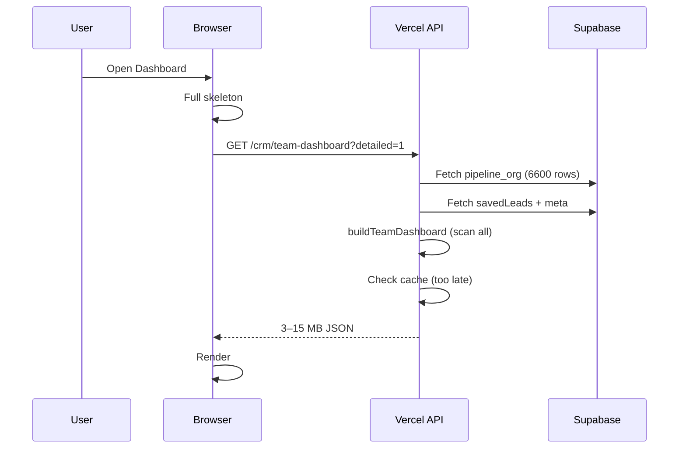

# Dashboard performance refactor

## Before (measured from architecture — Xindus ~6,600 leads)

| Metric | Value |
|--------|------:|
| PostgREST calls per dashboard open | **2–4** (full shard + meta + optional savedLeads) |
| Payload downloaded | **3–15 MB** (`pipeline_org_*` JSON) |
| Server CPU | Full `buildTeamDashboard` scan of **6,000+** entries |
| Team Intelligence | Always `detailed=1` → timeline + 1,500 activity window |
| Cache | Checked **after** shard fetch |
| Typical load time | **10–60 s** under Supabase Micro |
| UI | Full-page skeleton until single API completes |

### Before request flow



---

## After (target architecture)

| Metric | Target |
|--------|--------|
| PostgREST calls (hot path) | **1** small snapshot doc (~50–200 KB) |
| Full pipeline read | **Never** on user request — async refresh only |
| Cache | Checked **first** (60s TTL, 180s SWR) |
| Team Intelligence | Summary API first; timeline lazy |
| Dashboard load | **&lt; 500 ms** (cache hit: **50–200 ms**) |
| Team Intelligence summary | **&lt; 1 s** |
| Timeline | **&lt; 1 s** lazy, 30s cache |

### After request flow

```mermaid
sequenceDiagram
  participant U as User
  participant UI as Browser
  participant API as Vercel API
  participant C as Redis/Memory cache
  participant DB as Supabase snapshots

  U->>UI: Open Dashboard
  UI->>UI: Header + chrome immediately
  UI->>API: GET /crm/team-metrics
  API->>C: cacheGet (60s)
  alt cache hit
    C-->>API: payload
    API-->>UI: 50–200ms
  else cache miss
    API->>DB: team_snapshot_{org}_week (~100KB)
    API->>C: cacheSet
    API-->>UI: &lt;500ms
  end
  UI->>UI: Render KPIs + matrix
  UI->>API: GET /crm/activity-timeline (lazy)
  API->>DB: activity_snapshot (~50KB)
  API-->>UI: Timeline section
```

---

## Snapshot collections

| Collection | Contents | Refresh |
|------------|----------|---------|
| `dashboard_snapshot_{orgId}` | Org totals | Pipeline index refresh / worker |
| `team_snapshot_{orgId}_{period}` | Team intelligence + V3 (no timeline) | Every 5 min or async |
| `activity_snapshot_{orgId}_{period}_all` | Timeline + recent activities | Every 5 min or async |
| `myday_snapshot_{userId}` | Personal My Day payload | Same refresh job |

Refresh entrypoint: `refreshDashboardSnapshotsFromEntries` (worker / `scripts/warm-dashboard-snapshots.mjs`).

---

## API endpoints

| Endpoint | TTL | Purpose |
|----------|-----|---------|
| `GET /api/crm/dashboard-kpi` | 60s | Fast KPI strip |
| `GET /api/crm/my-day` | 60s | My Day from `myday_snapshot_*` |
| `GET /api/crm/team-metrics` | 60s | Team intelligence summary |
| `GET /api/crm/activity-timeline` | 30s | Lazy activity feed |
| `GET /api/crm/team-dashboard` | 60s | Legacy combined (snapshot-backed) |

---

## Warm snapshots after deploy

```bash
SUPABASE_URL=... SUPABASE_SERVICE_ROLE_KEY=... node scripts/warm-dashboard-snapshots.mjs
# Xindus only:
node scripts/warm-dashboard-snapshots.mjs --org=YOUR_ORG_ID
```

---

## Expected reductions

| Resource | Before | After |
|----------|--------|-------|
| Bandwidth per dashboard view | 3–15 MB | 50–200 KB |
| DB rows read | 6,000+ contacts | 0 contacts (snapshot docs only) |
| PostgREST ops | 2–4 heavy | 1 light |
| Concurrent CRM impact | High (shard lock) | Low |
