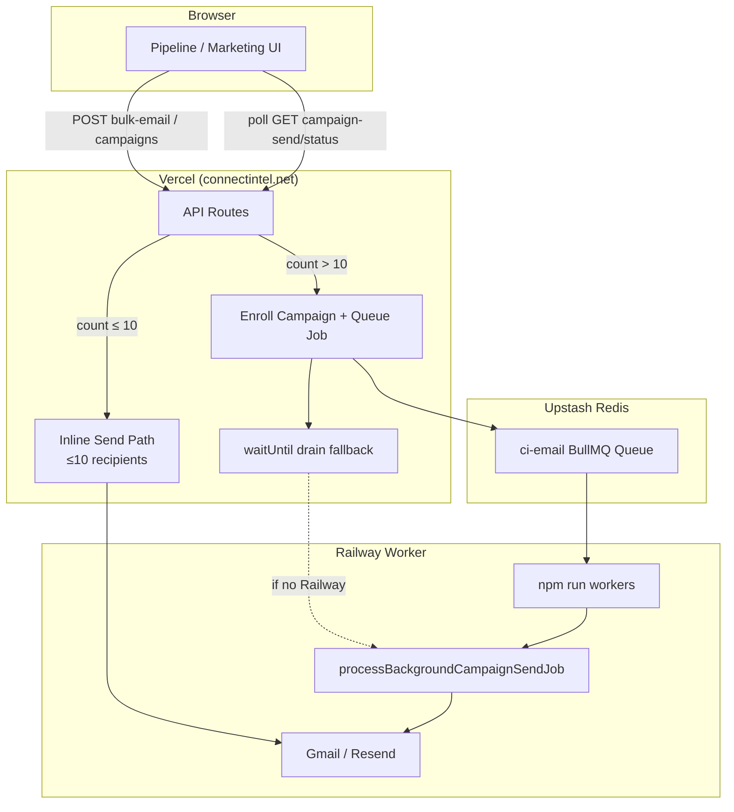

# Email dual-mode architecture

Connect Intel uses **two send paths** chosen automatically by recipient count.

## Threshold

| Recipients | Mode | Where it runs | Browser required? |
|------------|------|---------------|-------------------|
| **1–10** | **Inline** | Vercel API request | Only until response (~10s) |
| **>10** | **Queued** | Redis (BullMQ) + Railway worker | **No** — close tab anytime |

Single CRM emails (`/api/crm-send-email`) are always **inline** (one recipient).

## Architecture diagram



## Send lifecycle (queued mode)

```
queued → preparing → sending → completed | failed
```

Progress: `GET /api/campaign-send/status?campaignId=...`

## Scale tiers

| Volume | Path |
|--------|------|
| 1 email | Inline |
| 10 emails | Inline |
| 200 emails | Queue + 1 worker |
| 2,000 emails | Queue + worker (burst + re-enqueue) |
| 20,000+ | Queue + multiple worker instances (scale Railway replicas) |

## Code map

| File | Role |
|------|------|
| `lib/server/email/sendMode.js` | Threshold + mode resolution |
| `lib/server/email/dualModeSend.js` | Inline vs queue execution |
| `lib/server/pipelineBulkQueue.js` | Pipeline bulk enroll + mode |
| `lib/server/email/campaignSendOrchestrator.js` | BullMQ job + worker bursts |
| `workers/index.mjs` | Railway long-running worker |
| `lib/server/handlers/workers-cron.js` | Vercel drain fallback |

## Infrastructure

1. **Upstash Redis** — `REDIS_URL` on Vercel (installed)
2. **Railway worker** — see `docs/RAILWAY_WORKER.md`

Inline send is a **fallback for small batches only**. Bulk never depends on API request duration.
