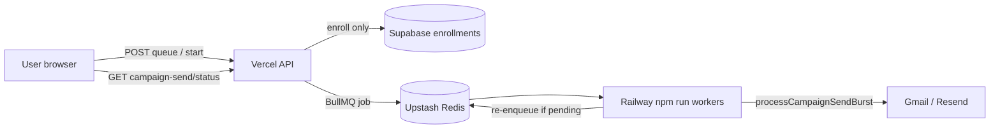

# Email Infrastructure V3

**Status:** Code shipped — requires `REDIS_URL` + Railway worker in production.

## Objective

User clicks **Send** → API returns in **&lt;3 seconds** → user can **close the browser** → workers deliver all emails.

## Architecture



## Campaign send statuses

| Status | Meaning |
|--------|---------|
| `draft` | Not started |
| `queued` | Enrolled, job pending |
| `preparing` | Worker picked up job |
| `sending` | Active burst |
| `paused` | User paused |
| `completed` | All recipients processed |
| `failed` | Unrecoverable error |
| `cancelled` | Stopped |

## V3 policy

- **`EMAIL_WORKER_ONLY=true`** (default) — browser drain disabled; sync bulk email blocked.
- Set `EMAIL_WORKER_ONLY=false` only for local debugging.

## Health endpoints

| Endpoint | Purpose |
|----------|---------|
| `GET /api/health` | Full platform health + `emailV3.ready` |
| `GET /api/infra/queue` | Redis, worker heartbeat, BullMQ queue depths |

### Verify production

```json
{
  "infra": { "redis": true, "backgroundEmail": true },
  "redis": { "ok": true },
  "worker": { "ok": true },
  "emailV3": { "workerOnly": true, "ready": true }
}
```

## Enable (ops)

1. Create [Upstash Redis](https://upstash.com) → copy `REDIS_URL` (`rediss://...`)
2. Vercel → Environment Variables → `REDIS_URL` (Production)
3. Railway → new service → `npm run workers` (see `railway.toml`)
4. Same env on Railway: `REDIS_URL`, Supabase, Gmail, `CRON_SECRET`
5. Redeploy Vercel + Railway
6. `curl https://connectintel.net/api/infra/queue`

## Rollback

Unset `REDIS_URL` or set `EMAIL_WORKER_ONLY=false` — reverts to legacy browser drain (not recommended at scale).
