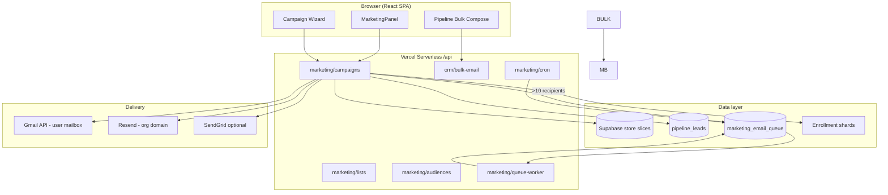
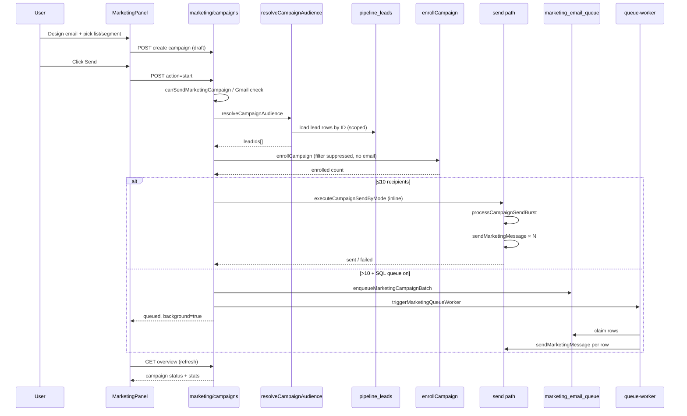
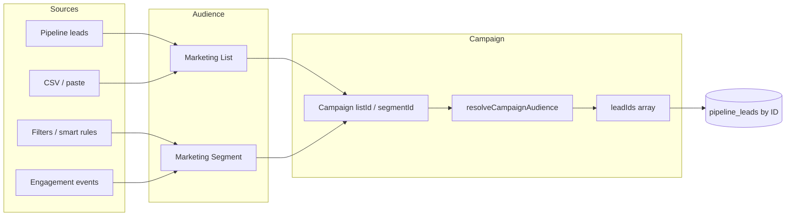
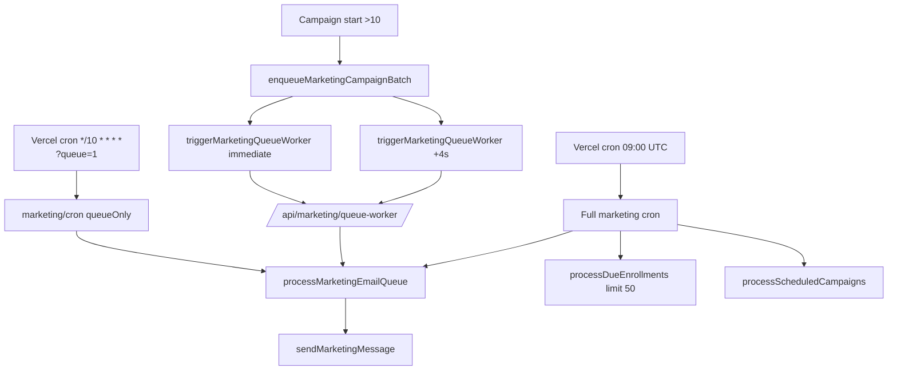
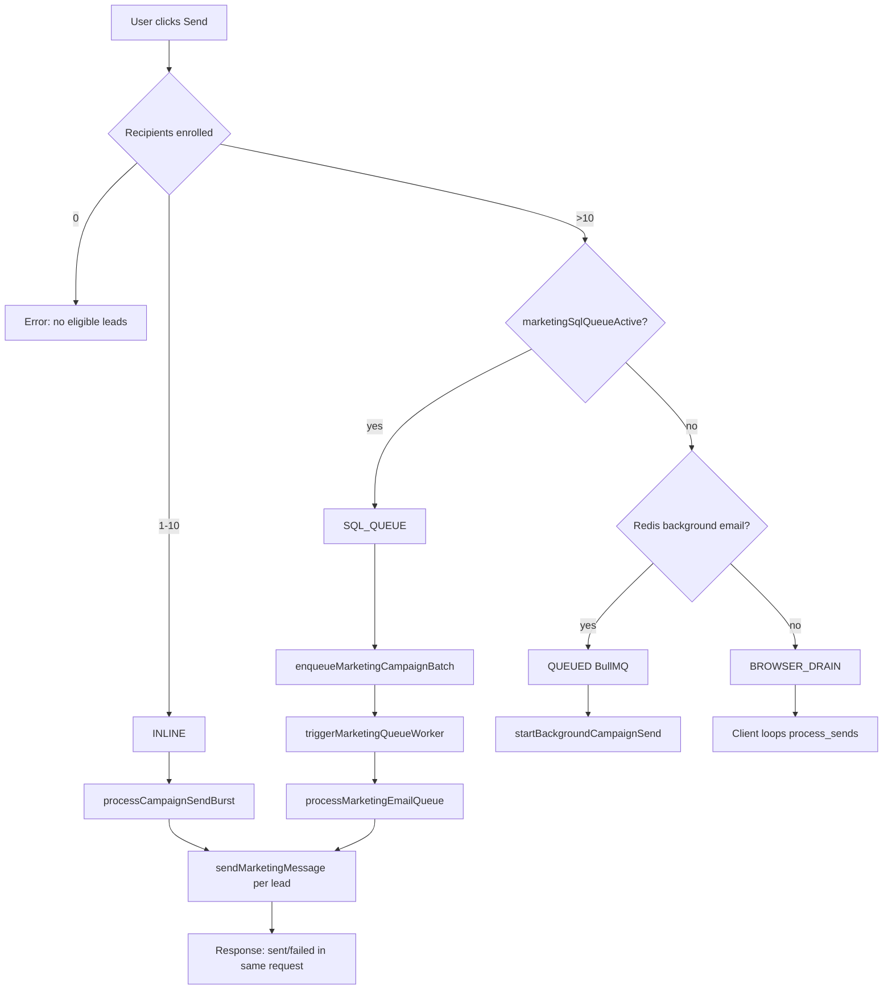

# Connect Intel — Marketing Email Workflow & PRD

**Version:** June 2026  
**Live:** [https://connectintel.net](https://connectintel.net)  
**Audience:** Product, engineering, ops  
**Related:** `docs/ENTERPRISE_SCALABILITY.md`, `docs/INFRA_SETUP.md`, `docs/RAILWAY_WORKER.md`

---

## 1. Executive summary

Connect Intel marketing email is a **campaign-centric** system built on top of the **CRM pipeline** (`savedLeads` / `pipeline_leads`). Users build audiences from **lists** or **segments**, design messages in the Marketing hub, and send via **Gmail**, **Resend** (org domain), or **SendGrid**.

Sending is **not** a single synchronous API call for bulk. The platform chooses one of four execution modes based on recipient count and infrastructure:


| Mode              | When                                                   | User experience                                       |
| ----------------- | ------------------------------------------------------ | ----------------------------------------------------- |
| **Inline**        | ≤10 recipients                                         | Send completes in the same request (~8–25s budget)    |
| **SQL queue**     | >10 recipients, Supabase queue on (production default) | Enqueue → background worker drains queue              |
| **Redis worker**  | >10 recipients, Redis + Railway worker                 | BullMQ job bursts                                     |
| **Browser drain** | >10 recipients, no Redis, no SQL queue                 | User must keep tab open; client polls `process_sends` |


**Production today (connectintel.net):** `marketingSqlQueue: true`, `redis: false`. Small sends (≤10) are inline; bulk uses `marketing_email_queue` + cron/trigger.

---

## 2. Product goals (PRD)

### 2.1 Goals

- Send **1:1 and bulk** commercial email from the same CRM contacts reps already work.
- Respect **tenant isolation**, **unsubscribe**, and **email consent**.
- Support **HubSpot-like** objects: lists, segments, campaigns, templates, automations.
- Scale to **thousands of recipients** without blocking CRM or melting Supabase.
- Log enough data for **open/click** analytics and campaign reports.

### 2.2 Non-goals (current)

- Full marketing automation platform parity with HubSpot (journeys are basic).
- Dedicated IP warming / deliverability consultancy (we integrate providers).
- SMS as primary channel (WhatsApp exists separately).

### 2.3 Personas


| Persona                 | Actions                                      |
| ----------------------- | -------------------------------------------- |
| **Marketing manager**   | Create lists, campaigns, approve sends       |
| **Marketing executive** | Design email, send test, launch campaign     |
| **Sales rep**           | Pipeline bulk email, view lead email history |
| **Org admin**           | Verify domain (Resend), connect team Gmail   |


### 2.4 Success metrics


| Metric                      | Target                    |
| --------------------------- | ------------------------- |
| Single/test send success    | <15s p95                  |
| Campaign start (enqueue)    | <5s p95 for any list size |
| Bulk 500 sends completion   | Background; no CRM outage |
| Overview page load          | <10s p95                  |
| Bounce/unsubscribe handling | 100% honored before send  |


---

## 3. User-facing surfaces

```
Marketing hub (?panel=marketing)
├── Overview          — getting started, KPIs
├── Campaigns         — wizard: design → audience → send (consent preview)
├── Audiences         — lists + segments
├── Templates         — reusable designs
├── Domains           — sender identity + send infrastructure status
└── Reports           — per-campaign analytics

CRM (parallel paths — constitution split)
├── Pipeline → Bulk email compose     — /api/crm/bulk-email (sales 1:1 + bulk)
├── Lead workspace → single email     — CRM thread
└── Sequences                         — drip; completion can trigger marketing automations
```

Legacy `?tab=bulk-email` in Marketing redirects to Pipeline bulk compose.

**Key UI files**

- `frontend/src/components/marketing/MarketingPanel.jsx` — hub, start/drain
- `frontend/src/components/marketing/MarketingCampaignWizardModal.jsx` — mobile 3-step wizard
- `frontend/src/components/marketing/MarketingCampaignChecklistBuilder.jsx` — desktop campaign setup
- `frontend/src/components/crm/BulkEmailCompose.jsx` — pipeline bulk (CRM sales email)

---

## 4. High-level architecture




---

## 5. Core objects & data model

### 5.1 Marketing list

- **Store:** `marketingLists` (Supabase JSON collection)
- **Contains:** `leadIds[]`, optional `snapshot` (cached lead IDs + counts)
- **Cap:** `MAX_LIST_LEADS = 2000`
- **Created from:** manual selection, pipeline filter, CSV import, smart list rules
- **API:** `GET/POST/PATCH/DELETE /api/marketing/lists`

### 5.2 Marketing segment

- **Store:** `marketingSegments`
- **Types:** static (fixed lead IDs) or dynamic (filter rules, engagement filters)
- **Resolution:** `resolveSegmentLeadIds()` — may scan pipeline + marketing events
- **Snapshot TTL:** 24h (`marketingAudienceSnapshots.js`)
- **API:** `GET/POST/PATCH/DELETE /api/marketing/segments`

### 5.3 Campaign

- **Store:** `marketingCampaigns` + shards:
  - `mcstat_<campaignId>` — send stats (sent, failed, enrolled)
  - Campaign send shard — message payload for workers
- **Status flow:** `draft` → `scheduled` | `active` → `completed` | `paused` | `stopped` | `archived`
- **Steps:** subject, body/blocks/design, optional follow-up steps
- **Channel:** `email` | `whatsapp`
- **API:** `marketing/campaigns`

### 5.4 Enrollment

- **Shard:** `marketingEnrollmentShard` — one row per (campaign, lead)
- **Fields:** `leadId`, `status`, `nextSendAt`, `sentCount`, `openCount`, `clickCount`
- **Created by:** `enrollCampaign()` on campaign start

### 5.5 SQL email queue (bulk)

- **Tables:** `marketing_email_queue`, `marketing_campaign_batches`
- **Migration:** `supabase/migrations/20260618120000_marketing_sql_queue.sql`
- **Claim:** RPC `ci_claim_marketing_email_queue` (SKIP LOCKED)
- **One row per** (campaign_id, lead_id)

---

## 6. End-to-end sequence: campaign send




### 6.1 Step-by-step (engineering)

1. **Create draft** — `POST /api/marketing/campaigns` with `listId` or `segmentId`, content, subject.
2. **Start** — `POST { action: 'start', id }`:
  - Validates **Gmail connected** OR **verified org Resend domain**.
  - `resolveCampaignAudience()` → lead ID list.
  - `loadPipelineStoreForLeadIds()` — hydrates leads from `pipeline_leads` (not full shard download).
  - `enrollCampaign()` — writes enrollment shards; skips unsubscribed / no email / no consent.
  - `syncMarketingCampaignStatus('active')`.
3. **Dispatch send** (`startCampaign` in `marketing-campaigns.js`):
  - **≤10:** `executeCampaignSendByMode` → inline burst.
  - **>10 + SQL queue:** `enqueueMarketingCampaignBatch` + `triggerMarketingQueueWorker`.
  - **>10 + Redis:** `startBackgroundCampaignSend` (BullMQ).
  - **>10, no queue:** returns `browser_drain`; UI loops `process_sends`.
4. **Per message** — `sendMarketingMessage()`:
  - Suppression check → consent check → personalize → tracking links → provider send.
5. **Post-send** — stats shard bump, queue row status, optional `pipeline_leads` CRM patch (`lastMarketingAt`).

---

## 7. How lists pull data from CRM




`**resolveCampaignAudience(store, user, campaign)**` (`marketingCampaigns.js`):

- **List:** `snapshotLeadIds(list)` if fresh, else `list.leadIds`.
- **Segment:** dynamic segments call `resolveSegmentLeadIds()` (pipeline scan + event filters).
- **Channel filter:** `filterLeadIdsForMarketingChannel()` — email vs WhatsApp.

**Eligibility at enroll time** (`listEligibleLeads`):

- Lead exists in org scope.
- Valid email on record.
- Not on `marketingSuppressions`.
- `checkCommercialEmailAllowed()` — consent flags on lead.

---

## 8. CRM linkage


| Link                  | How                                                             |
| --------------------- | --------------------------------------------------------------- |
| **Contacts**          | Lists/segments store `leadId` → same IDs as pipeline            |
| **Assignee / owner**  | Sends do not change assignee; rep visibility unchanged          |
| **Consent**           | `leadHasCommercialEmailConsent` enforced before send            |
| **Unsubscribe**       | Footer link → `marketing/unsubscribe` → `marketingSuppressions` |
| **Activity timeline** | **Varies by path** (see below)                                  |
| **Engagement tags**   | Opens/clicks → `recordMarketingEvent` → optional pipeline tags  |
| **Delivery metadata** | SQL queue patches `lastMarketingAt` on lead CRM JSON            |


### Activity logging gaps (known)


| Path                                  | CRM email thread                                            |
| ------------------------------------- | ----------------------------------------------------------- |
| Pipeline bulk (`/api/crm/bulk-email`) | Full thread via `emailActivityQueue`                        |
| SQL queue sends                       | Light CRM patch + marketing `send` timeline event (P1)      |
| Inline campaign sends                 | `logMarketingSend()` + timeline `send` event (P1)           |


**Implication:** Reps may see campaign analytics in Marketing reports but not always a full email row on the lead timeline for marketing-hub sends.

---

## 9. Email delivery & providers

**Resolution order** (`resolveMarketingEmailProvider`):

1. Campaign `emailProvider` field (`gmail` | `resend` | `sendgrid` | `auto`)
2. Org `marketingSettings.emailProvider`
3. Auto: Gmail if user connected → else verified Resend domain → SendGrid if configured

**Pre-flight gate (campaign start):**

- User must have **CRM Gmail** connected **OR** org **Resend domain verified**.

**Tracking:**

- Open pixel + link wrapping via `marketingTracking.js`
- Events stored in `marketingEvents` (capped slice, last 5000 events in monolith path)

---

## 10. Bulk sending — two paths

### 10.1 Marketing campaign (lists & segments)

1. Create list (up to 2000 leads).
2. Create campaign → attach list/segment → **preview_audience** shows consent eligibility.
3. Send → auto mode by count (inline / SQL queue).

### 10.2 CRM pipeline bulk compose (sales email)

- `BulkEmailCompose` → `/api/crm/bulk-email`
- Select leads in pipeline → compose → queue or drain
- **Tightly integrated** with lead timeline (`crm_bulk` audit source)
- Documented incident driver at 200+ sends (see challenges)

**Limits**


| Limit                 | Value                  |
| --------------------- | ---------------------- |
| Inline campaign       | ≤10                    |
| List/segment size     | 2000                   |
| CRM bulk per request  | 200 (`BULK_EMAIL_MAX`) |
| Bulk send concurrency | 5 parallel             |


---

## 11. Background processing & triggers




| Trigger                       | Schedule / event                 | What runs                                                   |
| ----------------------------- | -------------------------------- | ----------------------------------------------------------- |
| User clicks Send              | Immediate                        | `startCampaign` → inline or enqueue                         |
| `triggerMarketingQueueWorker` | On enqueue                       | POST queue-worker (+ optional inline drain 15)              |
| Cron `?queue=1`               | Every 10 min                     | `processMarketingEmailQueue` (up to 200 rows, 240s)         |
| Cron full                     | Daily 09:00 UTC                  | Queue + due enrollments + scheduled campaigns + Redis drain |
| Browser drain                 | Client loop                      | `POST action=process_sends` (disabled if Redis worker-only) |
| Local script                  | `npm run marketing:queue-worker` | 15s polling loop                                            |


---

## 12. Why sends feel slow

### 12.1 User-visible delays


| Symptom                                       | Cause                                                                                                                   |
| --------------------------------------------- | ----------------------------------------------------------------------------------------------------------------------- |
| **"Request timed out" on Marketing overview** | `GET marketing/campaigns?overview=1` loads campaigns + events + stats shards; large orgs exceeded 25–45s client timeout |
| **Send button spins then errors**             | `startCampaign` loads audience leads + enrolls + (previously) queued even 1 recipient without inline send               |
| **Bulk "queued" but nothing sends**           | SQL queue row written but worker trigger failed / cron was daily-only                                                   |
| **Keep tab open**                             | Browser drain mode (legacy fallback)                                                                                    |


### 12.2 Technical bottlenecks


| Bottleneck                 | Detail                                                                                |
| -------------------------- | ------------------------------------------------------------------------------------- |
| **Serverless time limits** | Vercel max 300s; bursts capped at 90s per `processCampaignSendBurst`                  |
| **Gmail rate limits**      | ~8 per burst, delays between bursts (`providerRateLimits.js`)                         |
| **Per-email work**         | Consent, suppression, personalize, tracking wrap, provider API, enrollment patch      |
| **Store reads**            | Overview merged stats for every campaign shard (`mergeCampaignStatsShards`)           |
| **Pipeline hydration**     | `loadPipelineStoreForLeadIds` scales with audience size at start                      |
| **No Redis in prod**       | No BullMQ worker; reliance on SQL queue + cron                                        |
| **Supabase pressure**      | 200 pipeline bulk emails caused PostgREST unhealthy (see `ENTERPRISE_SCALABILITY.md`) |


### 12.3 Recent fixes (June 2026)

- ≤10 recipients → **inline send** (no queue dependency).
- SQL queue → **inline drain first 15** + **10-minute cron**.
- Light overview → **cap stats shard reads** (24 recent campaigns).
- Post-send `load()` → **non-blocking** on failure.

---

## 13. Challenges faced (production)

### 13.1 SQL queue without reliable worker

**Problem:** All email campaigns routed to `marketing_email_queue` even for 1 recipient. Worker only ran if `CRON_SECRET` trigger succeeded; cron was once daily.

**Impact:** Emails stuck queued; UI showed timeout on refresh.

**Fix:** Inline path for ≤10; queue cron every 10 min; drain on enqueue.

### 13.2 Marketing overview timeout

**Problem:** Overview API read hundreds of `mcstat_`* shards + full `marketingEvents`.

**Impact:** Red banner "Request timed out" on `?panel=marketing&tab=overview`.

**Fix:** Light overview caps shard merge; longer client timeout (45–60s).

### 13.3 Pipeline bulk email CRM outage (Xindus)

**Problem:** ~200 sync bulk sends → hundreds of PostgREST ops → Supabase unhealthy → **entire CRM slow/down**.

**Documented in:** `docs/ENTERPRISE_SCALABILITY.md`

**Fix direction:** Queue-based bulk, batch enrollment patches, separate worker.

### 13.4 Redis disabled

**Problem:** `redis: false` on production → no background BullMQ worker.

**Impact:** Bulk depends entirely on SQL queue or browser drain.

**Mitigation:** SQL queue path; optional Railway worker when Redis added.

### 13.5 Gmail / domain prerequisites

**Problem:** Users start campaign without Gmail or verified domain.

**Impact:** 400 error with setup hint (not always clear in UI).

**Requirement:** Connect Work email (Gmail) or complete org domain DNS.

### 13.6 CRM timeline inconsistency

**Problem:** Marketing hub sends don't always create lead email thread entries.

**Impact:** Reps see activity in Marketing reports but not on lead record.

**Status:** Known gap; pipeline bulk path is richer.

### 13.7 Tenant / rep data alignment (adjacent CRM work)

**Problem:** Rep metrics vs pipeline assignee drift (`owner_id` vs JSON assignee).

**Impact:** Confusion between "leads touched" and "open leads" (documented separately).

---

## 14. Send mode decision tree




---

## 15. API reference (marketing email)


| Endpoint                        | Method   | Purpose                                       |
| ------------------------------- | -------- | --------------------------------------------- |
| `/api/marketing/campaigns`      | GET      | List / overview / report                      |
| `/api/marketing/campaigns`      | POST     | Create, `start`, `test_send`, `preview_audience`, `process_sends` |
| `/api/marketing/campaigns`      | PATCH    | Update, pause, resume, stop                   |
| `/api/marketing/lists`          | *        | List CRUD, add/remove leads                   |
| `/api/marketing/segments`       | *        | Segment CRUD, refresh                         |
| `/api/marketing/audiences`      | *        | Unified audience cards                        |
| `/api/marketing/cron`           | GET/POST | Scheduled processing                          |
| `/api/marketing/cron?queue=1`   | GET/POST | Queue-only drain                              |
| `/api/marketing/queue-worker`   | POST     | Claim + send queue rows                       |
| `/api/crm/bulk-email`           | POST     | Pipeline bulk compose                         |
| `/api/marketing/open`, `/click` | GET      | Tracking pixels/links                         |
| `/api/marketing/unsubscribe`    | GET/POST | Suppression                                   |


---

## 16. Environment flags


| Flag                                           | Effect                          |
| ---------------------------------------------- | ------------------------------- |
| `USE_MARKETING_SQL_QUEUE` / auto with Supabase | Enables SQL queue path          |
| `MARKETING_SQL_QUEUE_OFF`                      | Disables SQL queue              |
| `REDIS_URL`                                    | Enables BullMQ background sends |
| `BACKGROUND_EMAIL_SENDS_OFF`                   | Forces non-Redis paths          |
| `EMAIL_WORKER_ONLY`                            | Disables browser drain          |
| `CRON_SECRET`                                  | Auth for cron + queue-worker    |
| `RESEND_API_KEY`                               | Org domain sending              |
| `SENDGRID_API_KEY`                             | Optional provider               |


**Health check:** `GET /api/health` → `infra.marketingSqlQueue`, `redis`, `worker`.

---

## 17. Operational runbook

### Send not going out

1. Check `/api/health` — `marketingSqlQueue`, `redis`, `worker`.
2. Confirm user **Gmail** or **verified Resend domain**.
3. Campaign status in Marketing → Reports (queued vs active vs failed).
4. Query `marketing_email_queue` for pending rows (Supabase).
5. Manually trigger: `POST /api/marketing/queue-worker` with `CRON_SECRET`.
6. Or run `npm run marketing:queue-worker` locally against prod (careful).

### Overview timeout

1. Hard refresh; retry with `?overview=1&light=1` (default in UI).
2. Check Supabase latency / circuit breaker in health.

### Bulk campaign stuck

1. Check enrollment shard stats (`mcstat_`*).
2. Resume: `PATCH action=resume` on campaign.
3. Cron `?queue=1` should drain every 10 min.

---

## 18. Future roadmap (PRD backlog)


| Priority | Item                                                       |
| -------- | ---------------------------------------------------------- |
| P0       | Unified CRM timeline for all marketing send paths          |
| P0       | Enable Redis + Railway worker in production for redundancy |
| P1       | Batch enrollment writes (reduce Supabase load)             |
| P1       | Real-time send progress WebSocket or SSE                   |
| P2       | Meilisearch for segment resolution at scale                |
| P2       | Dedicated send reputation dashboard                        |
| P3       | A/B test winner auto-send                                  |


---

## 19. Key file index


| Area               | Path                                                           |
| ------------------ | -------------------------------------------------------------- |
| Campaign handler   | `lib/server/handlers/marketing-campaigns.js`                   |
| Send orchestration | `lib/server/email/dualModeSend.js`                             |
| Single message     | `lib/server/marketingSend.js`                                  |
| Audience           | `lib/server/marketingCampaigns.js` → `resolveCampaignAudience` |
| SQL queue          | `lib/server/marketingEmailQueue.js`                            |
| Queue worker       | `lib/server/marketingEmailQueueWorker.js`                      |
| Trigger            | `lib/server/marketingQueueTrigger.js`                          |
| Cron               | `lib/server/handlers/marketing-cron.js`                        |
| Providers          | `lib/server/emailProviders/index.js`                           |
| UI hub             | `frontend/src/components/marketing/MarketingPanel.jsx`         |
| Schema             | `supabase/migrations/20260618120000_marketing_sql_queue.sql`   |
| Cron config        | `vercel.json`                                                  |


---

## 20. Glossary


| Term              | Meaning                                                      |
| ----------------- | ------------------------------------------------------------ |
| **List**          | Static collection of `leadId`s                               |
| **Segment**       | Static or dynamic audience with rules                        |
| **Campaign**      | Message + audience + send lifecycle                          |
| **Enrollment**    | Per-lead row in a running campaign                           |
| **SQL queue**     | Postgres-backed `marketing_email_queue`                      |
| **Inline send**   | Synchronous send in start request (≤10)                      |
| **Browser drain** | Client polls server to send batches                          |
| **Shard**         | Per-campaign JSON blob in Supabase (`mcstat_`*, enrollments) |


---

*This document reflects the codebase and production configuration as of commit `9bf457a` (June 2026).*